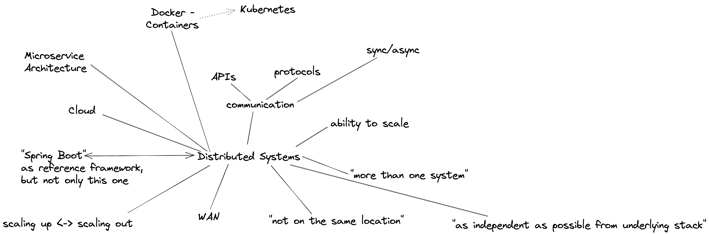
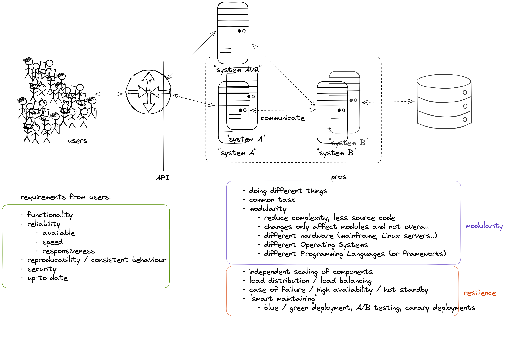

# Distributed Systems Lecture - Summer Semester 2023 - HSE

## Session 13-Mar-2023 Distributed Systems & Cloud Computing Introduction

### Intro questions:

* Which technologies or what do you have in mind in general if you think about "distributed systems"?
* the "WHY" - Why would people use and implement a distributed systems architecture?

### Student questions:

* How does the topic of Spring Boot relate to Distibuted Systems?
* What are reasons to not do Distributed Systems?
* How does Function as a Service work and what are sample uses cases?

## Session 20-Mar-2023 Intro to Cloud-based IDEs and Container Technology

* What are containers and how do they work?
* Containers vs. VMs
* History of containers and rise of Docker
* Docker concepts: daemon, hub, dockerfile, CLI
* Running containers with various options

### Objectives

_The student understands the concepts and use cases of container technology and is able to describe them. The first exercise is to pull sample images from an image registry (e.g. Docker Hub) and interact with them (run, expose port, execute shell, cleanup etc). After that the student can show how to build a custom image via Dockerfile and push it to a registry for others to access. Complete the exercises handed out via URL._

### Exercises/Lab task

* Create or get yourself a Docker Id (https://www.docker.com)
* Get a github or gitlab id. A public one, please :-)
* Do the container lab given at: https://hsexd.new.trainings.nvtc.io/ (up until Networks)
* Create a docker-compose file to start all 3 containers in the exercise
* Optional: Externalize

### Review questions

* "WHY" Containers? List advantages/disadvantages ..
* What is the difference between a container and a VM? List 3 criteria
* Which technologies led to the evolution of docker (and why)? 
* What is the difference between a docker daemon and the docker hub? 
* What is the difference between docker run, docker pull and docker start?
* Which command transitions from a container instance to an image?
* What are the Docker components and describe them?
* What does docker exec do? Provide a pseudo-code example and explain what it does 
* Explain the container latest tag

## Session 27-Mar-2023 Docker/Container Wrap-Up & Labs

* Docker storage
* Docker networks
* docker-compose

### Exercises/Lab task

* Finish the container lab given at: https://hsexd.new.trainings.nvtc.io/ (up until Networks)
* Create a docker-compose file to start all 3 containers in the exercise
* Optional: Externalize the database storage to the filesystem outside of the container
